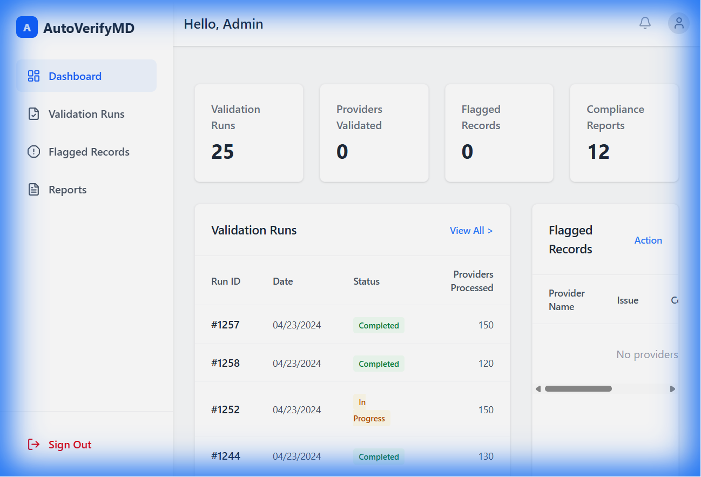

# AutoVerifyMD - AI-Powered Healthcare Provider Validation Platform

AutoVerifyMD is a robust, multi-agent AI platform designed to automate the verification and maintenance of healthcare provider directories. It leverages a modern tech stack with a FastAPI backend and a premium React frontend to ensure data accuracy and compliance.



## 🚀 Features

- **Multi-Agent Verification Engine**: Orchestrates specialized agents (Web Scraper, Enrichment, QA) to validate provider details.
- **Interactive Dashboard**: Real-time visualization of validation stats, flagged records, and verification history.
- **Provider Management**: View, filter, and manually trigger verification for healthcare providers.
- **Secure Authentication**: Simple login flow with user profile management (mock implementation for demo).
- **Responsive Design**: Built with Tailwind CSS for a seamless experience across devices.

## 🛠️ Tech Stack

### Backend
- **Framework**: FastAPI (Python)
- **Database**: SQLite (SQLAlchemy ORM)
- **Architecture**: Multi-Agent System (Mocked for prototype)
- **Task Queue**: Celery (Planned)

### Frontend
- **Framework**: React (Vite)
- **Styling**: Tailwind CSS, Lucide React (Icons)
- **Charting**: Recharts
- **Routing**: React Router DOM

## 📂 Project Structure

```
AutoVerifyMD/
├── backend/                # FastAPI application
│   ├── agents/             # Agent logic (Orchestrator, Workers)
│   ├── main.py             # API Entry point
│   ├── models.py           # Database models
│   ├── database.py         # DB connection config
│   └── ...
├── frontend/               # React application
│   ├── src/
│   │   ├── components/     # Reusable UI components (Sidebar, Tables, Charts)
│   │   ├── pages/          # Page views (Dashboard, Login, Runs)
│   │   └── App.jsx         # Main routing logic
│   └── ...
└── README.md
```

## 🏁 Getting Started

Follow these instructions to set up the project locally.

### Prerequisites
- **Python** 3.8 or higher
- **Node.js** v20+ and **npm**

### 1. Backend Setup

Navigate to the backend directory and install dependencies:

```bash
cd backend
# Create a virtual environment (optional but recommended)
python -m venv venv
# Activate venv:
# Windows: venv\Scripts\activate
# Mac/Linux: source venv/bin/activate

# Install requirements
pip install -r requirements.txt
```

Start the backend server:

```bash
uvicorn backend.main:app --reload
```
The API will be available at `http://localhost:8000`.

### 2. Frontend Setup

Open a new terminal, navigate to the frontend directory, and install dependencies:

```bash
cd frontend
npm install
```

Start the development server:

```bash
npm run dev
```
The application will run at `http://localhost:5173`.

## 🧪 Usage

1.  **Login**: Access the frontend URL. Use any email ending in `@autoverifymd.com` (e.g., `admin@autoverifymd.com`) and any password to log in.
2.  **Dashboard**: View the overview of provider stats.
3.  **Verify**: Click the "Verify" button on any pending provider to trigger the AI verification process.
4.  **Explore**: Navigate to "Validation Runs" or "Flagged Records" to view historical data.

## 🤝 Contributing

Contributions are welcome! Please fork the repository and submit a pull request for any enhancements or bug fixes.

## 📄 License

This project is licensed under the MIT License.
